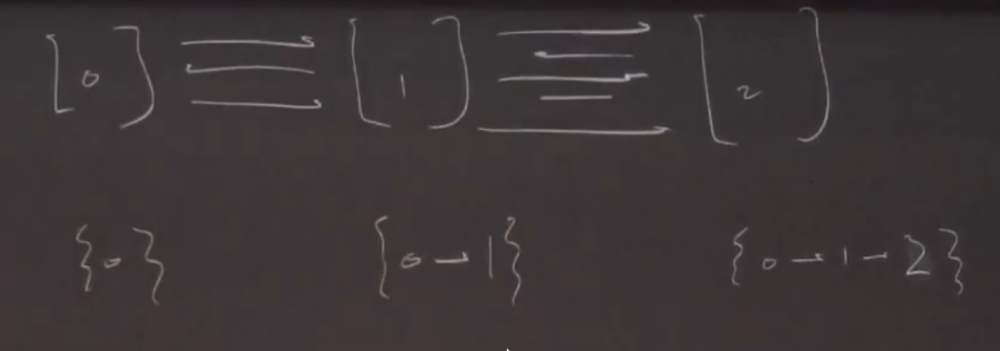

# Wednesday, November 11

Reference: [MSRI Workshop on Derived AG, Birational Geometry, Moduli Spaces](https://www.msri.org/workshops/862/schedules/25958).

Video: <https://www.youtube.com/watch?v=zRPa-VAvl6Q>

## Cotangent Complex and Derived de Rham Cohomology

Basic affine objects in AG: commutative rings, replace with simplicial commutative rings which we'll use as a base diagram.
Later: derived stacks and geometric derived stacks.

An evolution of objects:

- Algebraic schemes/spaces, e.g. $\PP^n$
  - Étale sheaves of sets (think functor of points), identified as discrete spaces $\mathcal{S}_{\leq 0}$ (so every component is contractible)
  - No higher homotopy groups

- The Picard stack $\underline{\Pic}_{X/k}$ for $X$ a smooth and proper $k\dash$scheme, which is an Artin stack (subclass: DM stacks)
  - Étale sheaves of groupoids $\mathcal{S}_{\leq 1}$
  - Can take a fundamental groupoid
  
  > This is the mapping stack $\underline{\Map}(X, K(\GG_m, 1))$.

- $K(\GG_m, n)$ a higher stack
  - A sheaf taking values in $n\dash$truncated spaces, i.e. a space where when basing at any point, there are no homotopy groups above degree $n$.
  - Stack with a single point, where the isotopy is $K(\GG_m, n-1)$.

Note that these are all built from affine schemes with a few acceptable moves.

:::{.example title="?"}
We can realize $B\GG_m = K(\GG_m, 1)$ as $[\pt/\GG_m]$ in stack notation.
Consider $K(\GG_m, 2) = [\pt / B\GG_m]$, this is a smooth Artin stack.
It's a higher geometric stack that still has smoothness properties.
:::

What does it mean to give a map from a scheme $X$ into a higher stack?
The world of of étale schemes taking values in $\mathcal{S}_{\leq n}$ is enriched in spaces.
There is a topological space $M\da \Map(X, K(\GG_m, n))$.
The homotopy groups are 
\[  
\pi_i M = 
\begin{cases}
H^{n-i}_{\et}(X, \GG_m) & 0\leq i \leq n \\
0 & \text{else}
\end{cases}
,\]
so this higher geometric stack that says something about higher cohomology groups.
We thus have étale sheaves taking values in higher topological spaces, and has some geometric meaning.
They're also built from geometric objects: iterating taking quotients by smooth actions.

Why derive things?
Schemes are equipped with sheaves of commutative rings, so the basic idea is let the sheaves take values in groupoids, stacks, etc.
So we can consider replacing the structure sheaf $\OO_X$ is itself a sheaf of spaces.

Derived schemes: consider $\spec k\tensor_{k[x]}^L k$, a derived tensor product.
This is an affine derived sing.
This is a complex with homology in degree 0 and 1, where degree 1 is $\Tor^1(k\tensor_{k[x]} k)$.
So analogously, we'll start with derived schemes and take quotients by smooth groups.
We get derived stacks, eg $\mathcal{M}_\phi$ the moduli of objects in some dg category $\mathcal{C}$.

### Simplicial Rings

We need to agree on what the local affine modules will look like. 
For our purposes, they'll be simplicial commutative rings.
Consider the derived category $\mathcal{C} \da D(\ZZ)_{\geq 0}$ and its connective objects, which are chain complexes $C_\wait$ where $H_i(C_\wait) = 0$ for $i<0$.
There is a **derived tensor product** which makes $\mathcal{C}$ into a symmetric monoidal category, $\tensor^L$.
Basic idea: look at commutative algebra objects in this symmetric monoidal category.

We have some choices:

- $E_\infty\dash$ring spectra

- Simplicial commutative rings,

- Over $\QQ$, $\QQ\dash$commutative DGAs.

:::{.definition title="Simplicial Commutative Ring"}
Let $\Delta$ denote the *simplex category*, the category of non-empty finite ordered sets with order-preserving maps.
We have the following situation:

\begin{tikzcd}
[0] &
 \ar[r, shift right=0.75ex] \ar[r, shift left=0.75ex] \ar[l] &

\end{tikzcd}

The arrows going up are face (or coface) maps, and the others are degeneracy maps.

If $\mathcal{C}$ is a category, then $s\mathcal{C} \da \Fun(\Delta\op, \mathcal{C})$ is the category of simplicial objects of $\mathcal{C}$.
:::

:::{.example title="of simplicial categories"}
\envlist

1. $\ssets \homotopic \Top$, not equivalent categories but as equivalent homotopy theories (theory up to weak equivalence).
  There are notions of weak equivalence (iso on $\pi_0$, and for each choice of basepoint, an isomorphism on all $\pi_{\geq 1}$ on each side.

    Here there is an $n\dash$simplex on the LHS, $\Delta^n = \hom_{\Delta}(\wait, [n])$, and on the RHS we have 
\[
\Delta^n_{\text{Top}}\da\ts{\tv{x_0, \cdots, x_n} \in \RR^n \st x_i\geq0,\, \sum x_i = 1}
\]

  If you make a function $\Delta^n \mapstofrom \Delta^n_{\text{Top}}$, by Yoneda, the presheaf category $P(\Delta) = \Fun(\Delta^op, \set)$ is generated by representable objects 

  Everything on the LHS is generated by taking colimits of the $\Delta^n$, so we can make some assignment and extend by colimits to get a functor $\ssets \to \Top$.
  So the notion of weak equivalence on the LHS is just given by pullback along this functor.
  The forward functor is the **singular complex construction**.
:::

